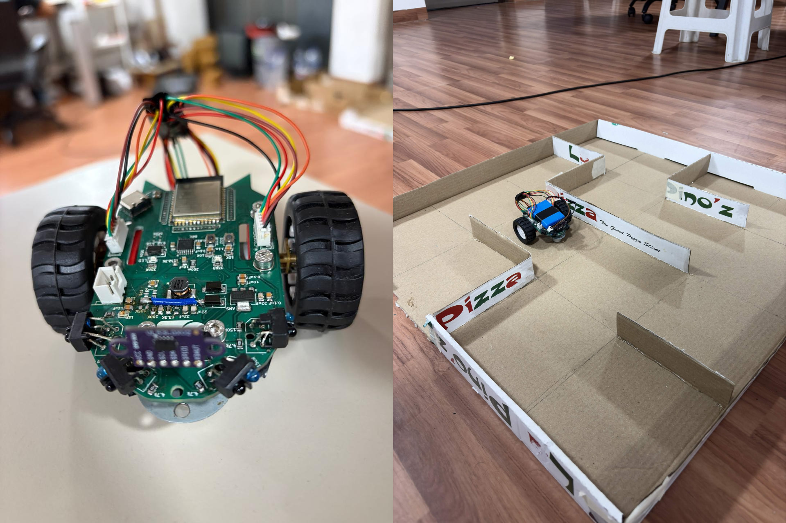
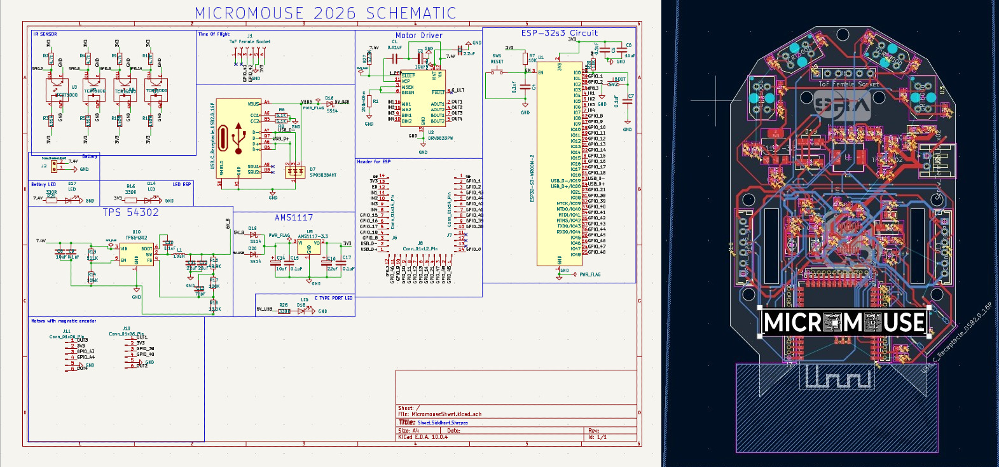
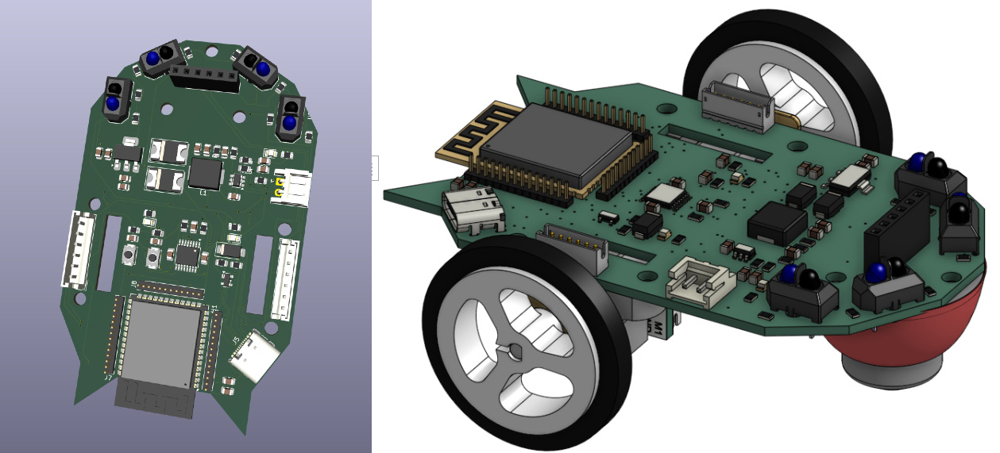

# Micromouse

MicroMouse is a small autonomous robot designed to navigate and solve a maze completely on its own.


## About The Project

Our project is about a wall-following micromouse robot built on ESP32-S3, using IR proximity sensors for wall-centering and junction detection, a VL53L0X ToF sensor for front-wall stopping, quadrature encoders for wheel feedback, and a WiFi-based web UI for live tuning of PID gains, thresholds, and duty cycle limits.

<p align="center">
  <a href="https://youtu.be/bc_Xk7g2EeM" target="_blank">
    
  </a>
  <a href="https://youtube.com/shorts/5PlMwJj3upM" target="_blank">
    
  </a>
</p>

## Project Overview

### Project Workflow

1. Learnt About the KI-CAD and ESP-IDF Basics
2. Execution of working of sensors on perfboard and making it move turns and a straight line
3. Designing PCB
4. PD tuning on PCB

### Hardware Used
- 1x ESP32-S3
- 1x DRV8833 Motor Driver
- 1x AMS1117 Buck Converter
- 2x DC encoder Motors
- 4x IR sensors
- 1x VL53L0X (Time of flight sensor)

### Pinout Mapping

| Component | Function / Pin | ESP32-S3 GPIO |
| :--- | :--- | :--- |
| **ToF Sensor** | I2C SDA / SCL | GPIO 41 / GPIO 42 |
| **IR Right (`IR_PIN_0`)** | ADC Input | ADC1 CH2 GPIO 3 |
| **IR Left (`IR_PIN_1`)** | ADC Input | ADC1 CH8 GPIO 9|
| **IR Left Diag (`IR_PIN_2`)** | ADC Input | ADC1 CH9 GPIO 10|
| **IR Right Diag (`IR_PIN_3`)**| ADC Input | ADC1 CH7 GPIO 8|
| **Encoder Motors** | Channel A | GPIO 5 / GPIO 4 |
| **Encoder Motors** | Channel B | GPIO 6 / GPIO 7 |

## CAD and PCB Models

### PCB Model



### CAD Models



## Installation and Setup

Prerequisites:
1. ESP-IDF v5.5 
2. Git
3. Python 3.10 or higher

**Setup:**
1. **Clone the Repository**
   ```bash
   git clone https://github.com/typewriter13/Micromouse
   cd Micromouse
   cd LeftWallFollow
2. **Configure and Build**
   ```bash
   idf.py set-target esp32s3
   idf.py build
3. **Flashing the Project**
   ```bash
   idf.py flash monitor


## System Architecture & Logic

### Sensor Logic

* **Time-of-Flight (ToF) Sensor :** Acts as the brake for the micromouse, whenever it senses a front wall under its threshold it stops and forces a U-Turn.
* **Left & Right IR Sensors :** By comparing distance readings on the left and right, the PD algorithm constantly adjusts motor speeds to keep the robot moving straight without drifting into side walls.
* **Left & Right Diagonal IR Sensors :** Handle early corner detection. When approaching a sharp turn, these sensors trigger an immediate hard turn before the robot can collide with the bend.

### Motor Logic

Movement is governed by adjusting duty cycles via Pulse-Width Modulation (PWM) to control motor speed and directional pins to set rotation direction:

* **Move Forward:** Both left and right motors run forward at equal PWM duty cycles.
* **Turn Left :** Left motor rotates slower while the right motor rotates faster.
* **Turn Right :** Left motor rotates faster while the right motor rotates slower.
* **U-Turn (180° Spin):** Left motor runs forward for some speed and at the same speed right motor runs backwards.

### Left Hand Follow Algorithm

At every node or intersection, the bot evaluates movement options in the following strict priority order:

1. **Turn Left:** If no wall is detected on the left, turn 90° left.
2. **Go Straight:** If the left path is blocked but the front path is clear, move forward.
3. **Turn Right:** If both left and front paths are blocked, turn 90° right.
4. **U-Turn:** If left, front, and right paths are all blocked (dead end), turn 180°.

Note: Left-Hand Follow guarantees a solution for any simply connected maze with goals on perimeter edges, though it does not guarantee the shortest path.

### Web UI & Live Tuning

The ESP32-S3 hosts a lightweight HTTP server allowing real-time calibration over WiFi without reflashing firmware.

* **PID Calibration:** Adjust $K_p$ and $K_d$ gains live as the bot navigates.
* **Threshold Adjustment:** Tune IR and ToF distance thresholds.
* **PWM Duty Cycle Limits:** Set `slow_duty_cycle`, `fast_duty_cycle`.

## Future Work

- Implementing Left hand Follow algorithm tuned according to the Maze which we have designed.
- Work and study many more algorithms which are more efficient than LHF.
- Integrate the encoder readings with our path calculations of the bot for mapping the maze and reading the distance travelled.
