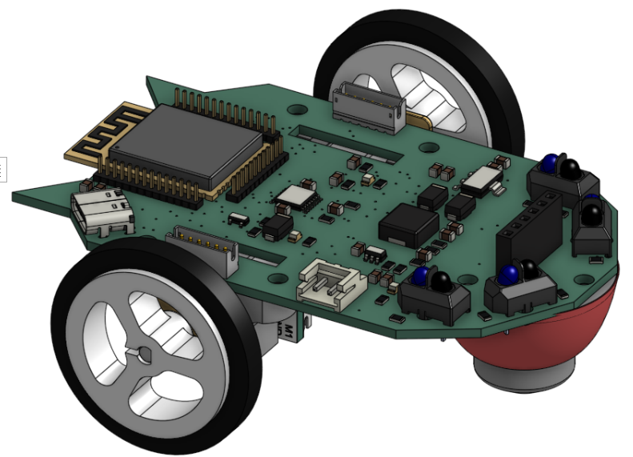

# Micromouse
MicroMouse is a small autonomous robot designed to navigate and solve a maze completely on its own. In this project, students will build a compact high-speed maze-solving robot from scratch using the ESP32-S3, combining embedded systems, PCB design, sensing, and path planning algorithms. 

